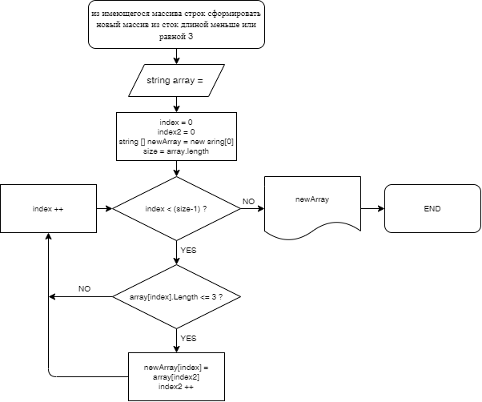

# **Итоговая проверочная работа**

Данная работа является проверкой знаний и навыков по итогу прохождения первого блока обучения по программе Разработчик.

## **Этапы практического выполнения работы:**
1. Создать репозиторий на GitHub
2. Нарисовать Блок-схему алгоритма
3. Снабдить репозиторий текстовым описанием решения
4. Написать программу, решающую поставленную задачу
5. Использовать контроль версий, показать умение работы с коммитами

**ЗАДАЧА:**

Написать программу, которая из имеющегося массива строк формирует массив из строк, длина которых не привышает 3 (трех) символов.

**Дополнительные положения:**

Первоначальный массив можно ввести с клавиатуры, либо задать на старте выполнения алгоритма.
*При решении не рекомендуется пользоваться коллекциями, лучше обойтись массивами.

**Прмеры:**

    ["Привет", "Hello", "45", "world", "^I^", ":-)"] -> ["45", "^I^", ":-)"]
    ["Москва", "Ростов", "Хабаровск", "Ея"] -> ["Ея"]

## ***1. Создать репозиторий на GitHub***

Сначала создал локальную папку и поместил в нее файл-исключение *.gitignore*

Следующим шагом, через терминал, инициализировал среду для работы с контролем версий.

Через онлайн платформу GitHub создал удаленный репозиторий и "подружил его ;-)" со своей локальной папкой.

## ***2. Нарисовать Блок-схему алгоритма***

С помощью расщирения ***Draw.io Integration*** для **VS Code** построил блок-схему. Вероятность того, что при написании кода ее придется доработать не исключается...

## ***3. Снабдить репозиторий текстовым описанием решения*** 

Собственно этот файл и является описательной частью...

## ***4. Написать программу, решающую поставленную задачу***

При написании программного кода пользовался, ранее сделанной, блок-схемой, но с небольшими изменениями дополняющими наглядность и функциональность...

Было написано несколько модулей, отличающихся своим функционалом. Большая часть их вспомогательные и один модуль - выполняет непосредственно поставленную задачу...

Программа принимает на вход:

* длину задаваемого массива;
* строковые значения элементов массива по количеству соответствующие ранее заданному размеру (длине) массива.

Ввод данных производится после пригласительного сообщения.

Программа выводит на экран:

* значения массива введенные с клавиатуры;
* значения массива, сформированного согласно условий поставленных задачей.

## ***5. Использовать контроль версий, показать умение работы с коммитами***

При выполнении Итоговой проверочной работы все манипуляции проводились в программе VS Code с ипользованием расширений, а так же с использованием ресурсов и функционала GitHub. Работа не является объемной, поэтому коммиты делались, большей частью поэтапно - согласно структуре работы.

Работа загружена на удаленный ресурс GitHub.

PS. Блок-схема была немного переделана под написанный код, но сам алгоритм не изменялся.